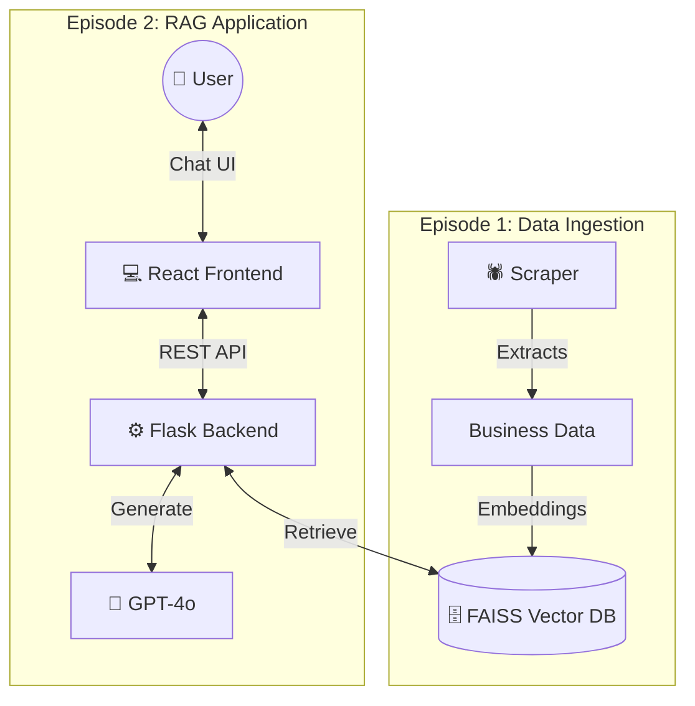

# Web Scraping Chatbot RAG

A production-ready RAG (Retrieval-Augmented Generation) chatbot for searching Thai businesses. Built with Flask, LangChain, FAISS, and GPT-4o.

**Live Demo:** [Your Lovable URL here]

---

## 🏗️ System Architecture

The project follows a modular **RAG architecture** split into three pipelines:

### 1. Data Pipeline (Scraper)
* **Engine**: Python 3.11 + Playwright (`crawl4ai`)
* **Function**: Scrapes YellowPages Thailand for business data
* **Output**: Structured CSV files → Vector embeddings → FAISS index

### 2. Backend (Flask + LangChain)
* **Router Agent**: Classifies user intent (Business Search / Chitchat / Knowledge)
* **RAG Engine**: Retrieves relevant businesses from FAISS, generates responses with GPT-4o
* **API**: RESTful endpoints for frontend communication

### 3. Frontend (React + TypeScript)
* **Built with**: [Lovable.dev](https://lovable.dev) - AI-powered frontend generator
* **Stack**: React 18 + Vite + TypeScript + Tailwind CSS + Shadcn/UI
* **Features**: Real-time chat, responsive design, premium UI components



---

## 🚀 Two Ways to Run This Project

### Option 1: Production (Live Online) ⭐

**What's Deployed:**
- ✅ **Frontend**: Hosted on [Lovable.dev](https://lovable.dev)
- ✅ **Backend**: Hosted on [Render.com](https://render.com)

**Access:**
1. Visit your Lovable frontend URL
2. Frontend automatically connects to backend on Render
3. Start chatting!

**URLs:**
- Frontend: `https://your-app.lovable.app` (replace with your URL)
- Backend API: `https://yellowpages-chatbot-api.onrender.com`

---

### Option 2: Local Development (Your Computer) 💻

Run both backend and frontend locally for testing and development.

#### **Step 1: Setup Backend**

1. **Clone Repository:**
   ```bash
   git clone https://github.com/MossMojito/web-scraping-Chatbot-RAG.git
   cd web-scraping-Chatbot-RAG
   ```

2. **Create Virtual Environment:**
   ```bash
   python3 -m venv venv
   source venv/bin/activate  # On Windows: venv\Scripts\activate
   ```

3. **Install Dependencies:**
   ```bash
   pip install -r requirements.txt
   ```

4. **Set Environment Variable:**
   ```bash
   export OPENAI_API_KEY=your-openai-api-key-here
   # On Windows: set OPENAI_API_KEY=your-openai-api-key-here
   ```

5. **Run Backend:**
   ```bash
   python run.py
   ```
   Backend will run at: `http://localhost:5000`

6. **Test Backend (Optional):**
   ```bash
   curl -X POST http://localhost:5000/chat \
     -H "Content-Type: application/json" \
     -d '{"message": "หาโยคะในกรุงเทพ"}'
   ```

#### **Step 2: Setup Frontend**

1. **Navigate to Frontend:**
   ```bash
   cd frontend
   ```

2. **Install Dependencies:**
   ```bash
   npm install
   # or
   bun install
   ```

3. **Configure API URL:**
   
   Update the backend URL in your frontend code to point to localhost:
   - Look for `API_URL` or similar configuration
   - Change from `https://your-render-url.onrender.com` to `http://localhost:5000`

4. **Run Frontend:**
   ```bash
   npm run dev
   ```
   Frontend will run at: `http://localhost:3000` (or similar)

5. **Open Browser:**
   Navigate to `http://localhost:3000` and start testing!

---

## 📁 Project Structure

```
web-scraping-Chatbot-RAG/
├── app/                    # Backend Flask application
│   ├── api/               # REST API routes
│   ├── agents/            # LangChain agents (Router, Search, Chat)
│   ├── core/              # Configuration
│   └── services/          # LLM and VectorStore integrations
│
├── data/
│   ├── raw/               # Scraped CSV files
│   └── vectorstore/       # FAISS vector index
│
├── frontend/              # React frontend (generated by Lovable)
│   ├── src/
│   │   ├── components/   # UI components
│   │   └── lib/          # Utilities
│   └── package.json
│
├── scraper/               # YellowPages web scraper
│
├── run.py                 # Backend entry point
├── Procfile              # Render deployment config
├── render.yaml           # Render service config
└── requirements.txt      # Python dependencies
```

---

## 🚢 Deployment Guide

### Backend Deployment (Render)

1. **Sign up** at [render.com](https://render.com)
2. **New Web Service** → Connect your GitHub repository
3. **Configure:**
   - **Runtime**: Python 3
   - **Build Command**: `pip install -r requirements.txt`
   - **Start Command**: `gunicorn run:app`
4. **Environment Variables:**
   - Add `OPENAI_API_KEY` in Render dashboard
5. **Deploy** → Render auto-deploys on every git push

### Frontend Deployment (Lovable)

The frontend was built using [Lovable.dev](https://lovable.dev), an AI-powered platform that generates React code.

**Option A: Deploy on Lovable (Recommended)**
1. Import project to Lovable
2. Configure backend API URL (your Render URL)
3. One-click deploy

**Option B: Deploy elsewhere (Vercel/Netlify)**
1. Build: `npm run build` in `/frontend`
2. Deploy the `dist` folder to Vercel/Netlify

---

## 🛠️ Tech Stack

**Backend:**
- Python 3.11
- Flask (Web framework)
- LangChain (RAG orchestration)
- FAISS (Vector database)
- OpenAI GPT-4o (LLM)

**Frontend:**
- React 18 + TypeScript
- Vite (Build tool)
- Tailwind CSS (Styling)
- Shadcn/UI (Component library)
- TanStack Query (API calls)

**Infrastructure:**
- Render (Backend hosting)
- Lovable (Frontend hosting)
- GitHub (Version control)

---

## 🕷️ Scraper (Optional)

To update the business data:

1. Navigate to scraper directory:
   ```bash
   cd scraper
   ```

2. Run the scraper:
   ```bash
   python yellowpages_scraper.py
   ```

3. New data will be saved to `data/raw/`

---

## 📝 Environment Variables

**Required:**
- `OPENAI_API_KEY` - Your OpenAI API key for GPT-4o and embeddings

**Optional:**
- `FLASK_ENV` - Set to `development` or `production`
- `PORT` - Port number (default: 5000)

---

## 🤝 Contributing

Contributions are welcome! Please feel free to submit a Pull Request.

---

## 📄 License

This project is open source and available under the [MIT License](LICENSE).

---

## 🔗 Links

- **Live Demo**: [Your Lovable URL]
- **Backend API**: [Your Render URL]
- **GitHub**: https://github.com/MossMojito/web-scraping-Chatbot-RAG

---

## 📧 Contact

For questions or feedback, please open an issue on GitHub.
